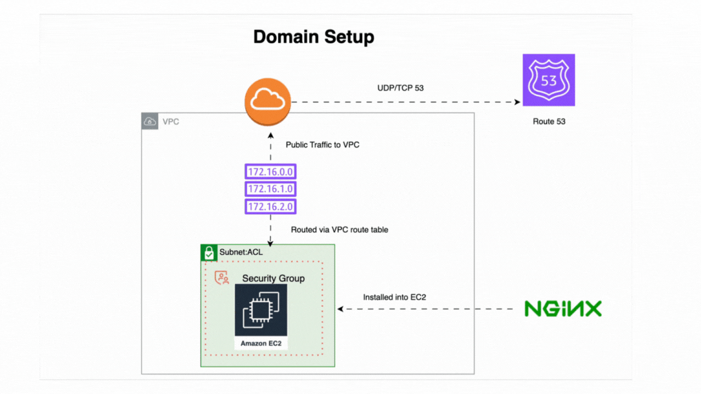
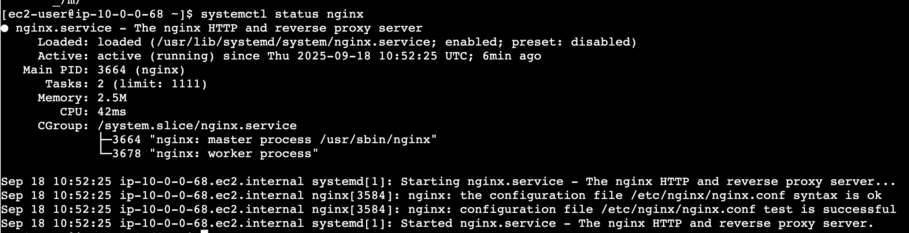
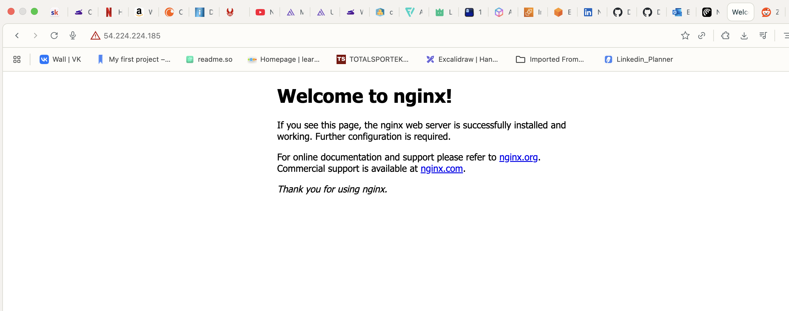

# Networking Module

This module contains AWS CDK constructs for setting up networking resources and deploying a web application in the AWS cloud.

## Table of Contents

- [About the Module](#about-the-module)
- [Prerequisites](#prerequisites)
- [System Architecture](#system-architecture)
- [File Structure](#file-structure)
- [Deployment](#deployment)
- [Usage and Verification](#usage-and-verification)
- [Clean Up](#clean-up)
- [Summary](#summary)

## About the Module

This module provisions a Virtual Private Cloud (VPC) with public subnets and deploys an EC2 instance running an Nginx web server. The EC2 instance is configured with a security group that allows HTTP traffic on port 80 and SSH access on port 22. The instance uses a specified key pair for secure access. Additionally, it sets up a Route53 hosted zone and an 'A' record to point a domain to the EC2 instance's public IP address.

## Prerequisites

- AWS CDK installed
- AWS CLI configured with appropriate credentials
- Node.js and npm installed
- An existing EC2 key pair in the desired AWS region
- A domain name purchased from Cloudflare (or any other registrar)

## System Architecture



The architecture consists of the following components:

- **VPC**: A dedicated virtual network for your AWS resources.
- **Public Subnets**: Subnets within the VPC that have a direct route to an internet gateway.
- **EC2 Instance**: A virtual server running Nginx.
- **Security Group**: A virtual firewall that controls inbound and outbound traffic to the EC2 instance.
- **Route53**: AWS's DNS service, used to manage the domain and point it to the EC2 instance.
- **Cloudflare**: The domain registrar from where the domain is purchased.

## File Structure

```
.
├── .env
├── .env.example
├── .gitignore
├── cdk.json
├── package.json
├── tsconfig.json
└── lib
    ├── ec2.ts
    └── route53.ts
```

## Deployment

1. **Install Dependencies:**

   ```bash
   npm install
   ```

2. **Deploy the CDK Stack:**
   ```bash
   cdk deploy --all
   ```

## Usage and Verification

### 1. NGINX Installation

First, install the dependencies on the EC2 instance. You can SSH into the instance using the key pair you specified.

```bash
sudo yum update -y
sudo yum install nginx -y
sudo systemctl start nginx
sudo systemctl enable nginx
```

After installation, you can check the status of the Nginx service:



### 2. Test the Public IP

Take the public IP address of the EC2 instance and paste it into your web browser. You should see the default Nginx welcome page.



### 3. Test the Domain

The CDK stack configures Route53 to point your domain to the EC2 instance. An 'A' record is created that points to the public IP address of the EC2 instance.


You can now access your web server using your domain name:

```
http://nginx.ceedev.co.uk
```

### 4. Stop EC2

To avoid incurring unnecessary charges, stop the EC2 instance when you are not using it.

## Clean Up

To remove all the resources created by this module, run the following command:

```bash
cdk destroy --all
```

## Summary

- ✔️ Registered domain in Route53
- ✔️ Deployed EC2 instance with NGINX
- ✔️ Configured DNS A record in Route53
- ✔️ Verified NGINX accessible via domain
- ✔️ Stopped instance to minimize AWS costs
